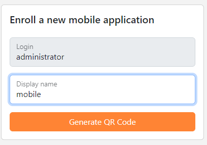
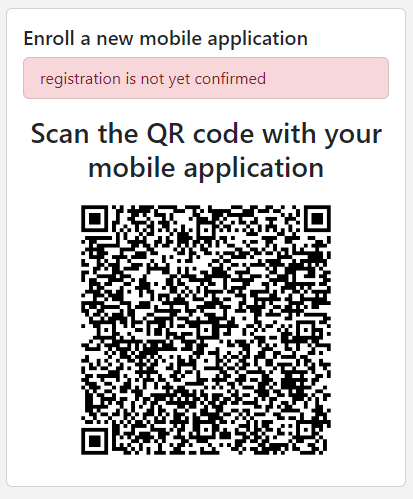

# Client-Initiated Backchannel Authentication (CIBA)

Client-Initiated Backchannel Authentication (CIBA) is an authentication flow where the client application initiates the authentication process on behalf of the end-user. 
It is designed for scenarios where the end-user may not have a browser or cannot actively participate in the authentication process.

According to the specification found at [https://openid.net/specs/openid-client-initiated-backchannel-authentication-core-1_0.html](https://openid.net/specs/openid-client-initiated-backchannel-authentication-core-1_0.html), Client-Initiated Backchannel Authentication (CIBA) is not applicable to Public Clients. Only Confidential Clients, such as Console Applications, Websites, or REST APIs, are eligible to use CIBA.

The CIBA specification defines two types of devices:

* `Consumption Device` : This device initiates the CIBA flow by interacting with the OPENID Server.
* `Authentication Device` : This device receives notifications coming from the OPENID Server.

A classical use case is an E-Commerce REST API requesting an access token from the OPENID Server of the Bank. In this scenario, the `Consumption Device` is represented by the REST API, and the `Authentication Device` is the Bank Mobile Application. The Bank Mobile Application receives notifications from the OPENID Server. When the end-user accepts the consent, the Consumption Device can obtain an access token and interact with the Bank API to initiate the money transfer.

In this tutorial, we will explain how to create a Console Application (`Consumption Device`) that initiates a CIBA Authentication Request and obtains an Access Token by polling the `Token` endpoint.

The client will have the following configuration:

| Configuration                            | Value           |
| ---------------------------------------- | --------------- |
| Client Authentication Method             | tls_client_auth |

:::info
The source code of this project can be found [here](https://github.com/simpleidserver/SimpleIdServer/tree/master/samples/DeviceUseCIBA).
:::

To implement the CIBA in a console application, you'll need to follow the following steps.

## 1. Configure a client certificate

Utilize the administration UI to create a client certificate.

1. Open the IdentityServer website at [https://localhost:5002](https://localhost:5002).
2. In the Certificate Authorities screen, choose a Certificate Authority from the available options. Remember that the selected Certificate Authority should be trusted by your machine. You can download the certificate and import it into the appropriate Certificate Store.
3. Click on the `Client Certificates` tab and then proceed to click on the `Add Client Certificate` button.
4. Set the value of the Subject Name to `CN=client` and click on the `Add` button.
5. Click on the `Download` button located next to the certificate.

## 2. Configure an application

Utilize the administration UI to configure a new OpenID client :

1. Open the IdentityServer website at [https://localhost:5002](https://localhost:5002).
2. In the Clients screen, click on `Add client` button.
3. Choose `FAPI2.0`.
4. Select `Device` and click on next.
5. Fill-in the form like this and click on the `Save` button to confirm the creation.

| Parameter    | Value           |
| ------------ | --------------- |
| Identifier   | cibaConformance |
| Name         | cibaConformance |
| Subject Name | CN=client       |

## 3. Create a consumption device

Finally, create and configure a consumption device.

1. Open a command prompt and execute the following commands to create the directory structure for the solution.

```
mkdir DeviceUseCIBA
cd DeviceUseCIBA
mkdir src
dotnet new sln -n DeviceUseCIBA
```

2. Create a web project named `ConsoleApp` and install the `IdentityModel` NuGet package.

```
cd src
dotnet new console -n ConsoleApp
cd ConsoleApp
dotnet add package IdentityModel
```

3. Add the `ConsoleApp` project into your Visual Studio solution.

```
cd ..
dotnet sln add ./src/ConsoleApp/ConsoleApp.csproj
```

4. Edit the `Program.cs` file and copy the following code. 


```
using IdentityModel.Client;
using System.Security.Authentication;
using System.Security.Cryptography.X509Certificates;

var certificate = new X509Certificate2(Path.Combine(Directory.GetCurrentDirectory(), "CN=client.pfx"));
var req = new BackchannelAuthenticationRequest()
{
    Address = "https://localhost:5001/master/mtls/bc-authorize",
    ClientId = "cibaConformance",
    Scope = "openid profile",
    LoginHint = "user",
    BindingMessage = "Message",
    RequestedExpiry = 200
};
var handler = new HttpClientHandler();
handler.ServerCertificateCustomValidationCallback = (message, cert, chain, errors) => { return true; };
handler.CheckCertificateRevocationList = false;
handler.ClientCertificateOptions = ClientCertificateOption.Manual;
handler.SslProtocols = SslProtocols.Tls12;
handler.ClientCertificates.Add(certificate);
var client = new HttpClient(handler);
var response = await client.RequestBackchannelAuthenticationAsync(req);

bool cont = true;
while(cont)
{
    var tokenResponse = await client.RequestBackchannelAuthenticationTokenAsync(new BackchannelAuthenticationTokenRequest
    {
        Address = "https://localhost:5001/master/mtls/token",
        ClientId = "cibaConformance",
        AuthenticationRequestId = response.AuthenticationRequestId
    });
    if(tokenResponse.IsError)
        Console.WriteLine(tokenResponse.Error);
    else
    {
        Console.WriteLine(tokenResponse.AccessToken);
        cont = false;
    }
}
```

5. Replace the `CN=client.pfx` certificate with the one you have previously downloaded.

Once the consumption device is configured, you can choose one of the following push notification methods to receive the back channel authentication.

## 3.1 Console notification method

By default, the console notification method is configured in the settings of all users.

When you run the consumption device, a `green message` will be displayed in the Identity Server instance.
Copy the URL from the browser and authenticate using the following credentials:

| Credential | Value    |
| ---------- | -------- |
| Login      | user     |
| Password   | password |


Once the consent is granted, the access token will be displayed by the console application.

## 3.2 Gotify notification method

Before being able to use the Gotify Server as a notification method, you must check its configuration:

1. Navigate to the details view of the `user`.
2. Under the notification mode, select `Gotify` and click on the `Save` button.
3. Open the `Authentications` screen and navigate to the `Gotify` authentication method.
4. Check the following parameters :

| Parameter | Description                            |
| --------- | -------------------------------------- |
| BaseUrl   | Url of the gotify service              |
| Login     | Login of the administration account    |
| Password  | Password of the administration account |

Once the configuration of the Gotify Server is finished, the mobile application can be enrolled:

1. Open the [Mobile application](../mobileapplication).
2. Click on the `Settings` tab. Next to the `Choose notification mode` option, select `Gotify`.
3. Browse the [Identity Server URL](https://openid.simpleidserver.com/master/Home/Profile), and authenticate with the `user` account.
4. Under the `Credentials` section, click on the `Mobile` to enroll the mobile application.
5. Set the Display name to `mobile` and click on the `Generate QR Code` button.



6. Scan the QR code with your mobile application. If the mobile application is successfully enrolled, a success message should be displayed.



The mobile application is ready to receive back-channel notifications.

When you run the consumption device, a popup will be displayed in the mobile application. You can click on the `Accept` button.


Once consent is granted, the access token will be displayed by the console application.